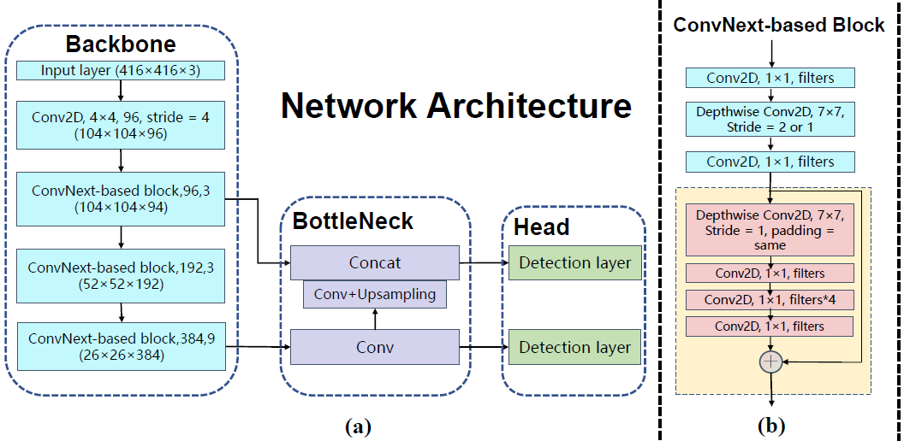
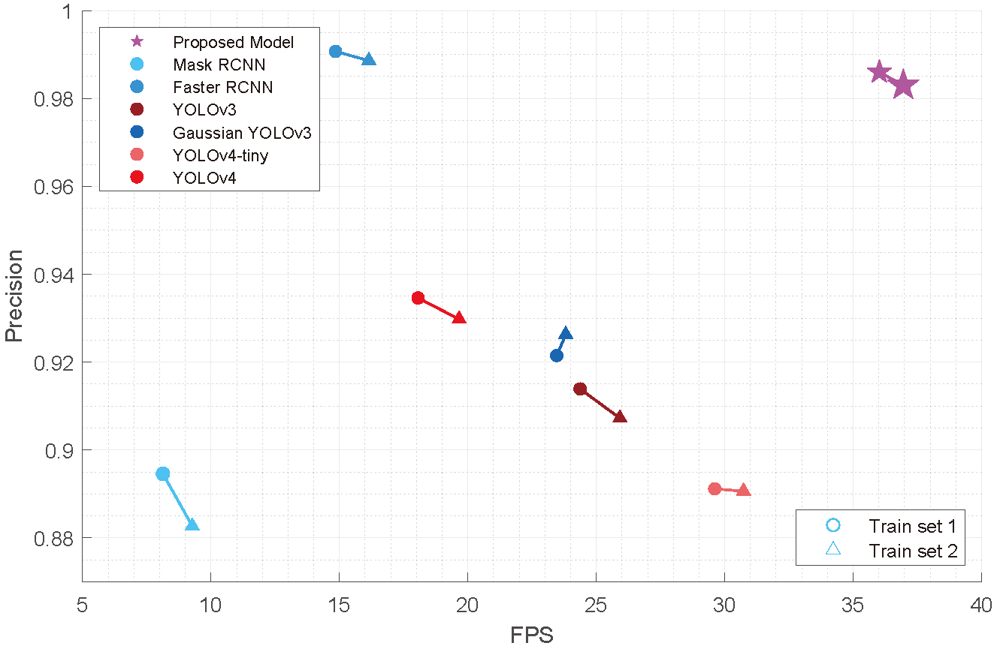

# MicrorobotsDetection_TrappingPoints

This repository is the official implementation of "Machine Learning-Based Real-Time Localisation and Automatic Trapping of Multiple Microrobots in Optical Tweezer"(MARSS 2022).

The key contributions of this paper are threefold:
*  A deep neural network model is constructed based on a modified YOLOv4-tiny architecture for multiple microrobots localisation, where a ConvNext-based block is used as the backbone for feature extraction and Gaussian modeling is used to optimise the output of the detection head. Self-supervised learning with Mosaic data augmentation is used for model training.
*  A machine learning-based ellipse detection technique is proposed to identify the optimal trapping points for each localised microrobot in the bounding box, through which the positions of the laser spots can be determine to manipulate the microrobots stably. 

The implementation is as follows.

## Requirements
* To create a new conda environment:
```
conda create -f environment.yaml
```
A new conda environment named as "microrobots" will be established.

## Data Pre-processing and Data Augmentation
We adopt edge detection as data preprocessing and Mosaic data augmentation in our work. The data set is self-supervised constructed, and Mosaic data augmentation is used for reduce the volume of the dataset as the data collection of microrobots is tedious and verify the adaptation of the proposed netwrok. 
* Data pre-processing:
```
python data_preprocessing.py
```

* Mosaic data augmentation:
```
python mosaic.py
```

## Microrobots Detection

The network Architecture is shown as bellow:
<p align="left">

</p>  

###  Training
* To train the model(s) in the paper, run this command:
```
python train.py
```

###  Evaluation
* To evaluate the results, run this command:
```
python evaluate.py
```

### Results
* Our model achieves the following performance:

|       Methods       |    Precesion(%)  |     Recall(%)    |        FPS       |
| :-----------------: | :--------------: | :--------------: | :--------------: |
|      train set 1    |       98.6       |      99.81       |       36.02      |
|      train set 2    |       97.3       |      99.931      |       36.95      |

* Comparison experiments results with SOTA detection models:
<p align="left">

</p>  

## Optimal Trapping Points Determination

### Ellipse Detectioin
* To detect the ellipses in the bounding box of microrobots, run this command:
```
python ellipse_detection.py
```
### Results 
* Our model achieves the following performance:

|       Methods       |        EED       |       EDR(%)     |       FPR(%)     |
| :-----------------: | :--------------: | :--------------: | :--------------: |
|    proposed model   |      27496       |      96.77       |       1.958      |
|Simple Blob Detection|      21064       |      74.13       |       8.677      |
|   Hough Transform   |      23758       |      83.61       |       5.341      |

where "EED" represents the effective ellipse detected; "EDR" represents the effective detection rate, and "FPR" represents the false positive rate.

## Real-time Detection

To real-time detection, run this command:
```
python detect.py
```

### Demo

A demo with microrobot and ellpise detected is released as follows:


https://user-images.githubusercontent.com/67178826/180041927-5150fefa-1ff1-48d8-ac6d-a7cfc7c341c2.mp4


